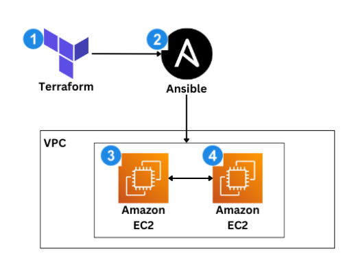
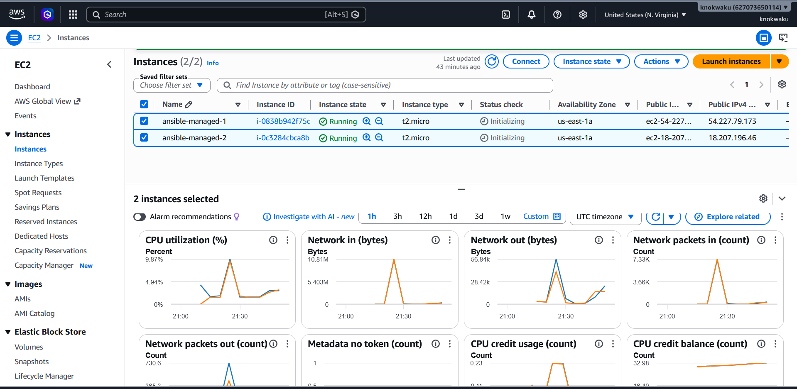
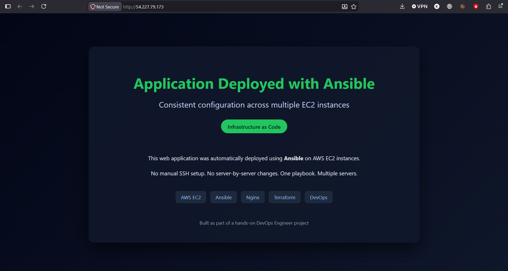
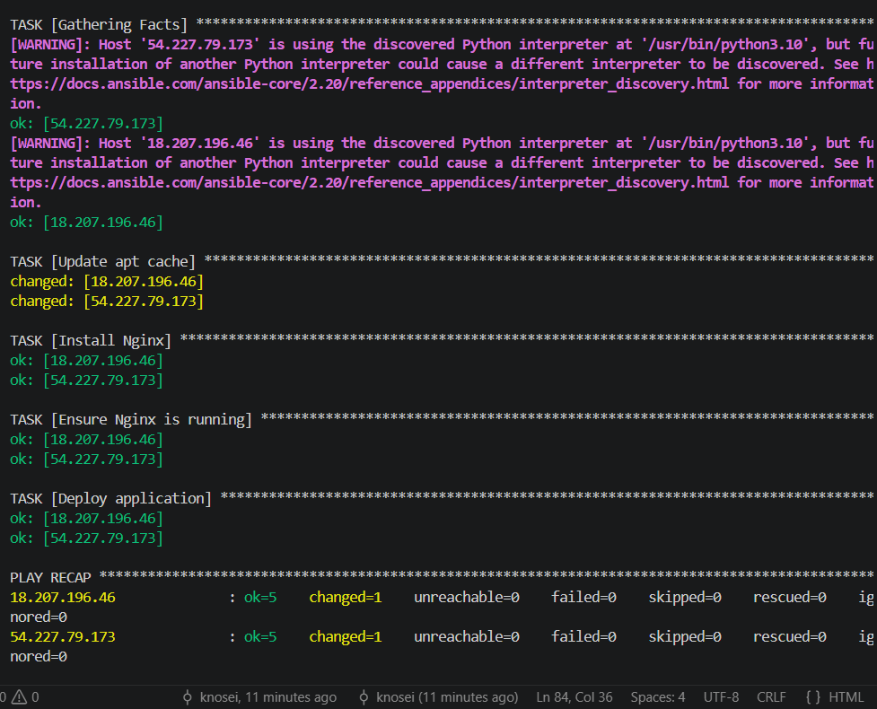

# Configuration Management with Ansible

Automated AWS infrastructure provisioning and server configuration management using **Terraform** and **Ansible**.

## Project Overview

CloudNova, a growing SaaS company, was facing operational issues from manually configuring backend EC2 servers — inconsistent setups, error-prone updates, and no repeatable process across environments.

This project solves that by combining:

- **Terraform** to provision AWS infrastructure (EC2 instances, security groups, SSH key registration)
- **Ansible** to configure those servers consistently, deploy an application, and enforce a repeatable, idempotent desired state — without any manual SSH work

The focus is on configuration management fundamentals: a single control node managing multiple servers, applying the same configuration reliably every time.

## Architecture



1. **Terraform** provisions EC2 infrastructure in AWS
2. **Ansible** acts as the control node for configuration mangement
3. Ansible connects to the **first EC2 instance** using SSH.
4. Ansible connects to the **second EC2 instance** using SSH.

## Tech Stack

| Tool | Purpose |
|------|---------|
| Terraform | Infrastructure as Code (provisioning) |
| Amazon EC2 | Virtual servers (managed nodes) |
| Amazon VPC | Networking |
| AWS Security Groups | Network access control |
| Ansible | Configuration management & deployment |
| AWS IAM | Authentication and permissions |
| Nginx | Web server on managed nodes |

## Project Structure

```
ansible-aws-config-management/
├── terraform/
│   ├── main.tf              # Provider, AMI lookup, key pair, security group, EC2 instances
│   ├── variables.tf         # Input variable definitions
│   ├── terraform.tfvars     # Actual values (gitignored)
│   └── outputs.tf           # Exposes EC2 public IPs for Ansible
├── ansible/
│   ├── inventory.ini        # Target servers (gitignored — IPs change per deploy)
│   ├── playbooks/
│   │   └── setup.yml        # Installs Nginx, deploys the app
│   └── files/
│       └── index.html       # Application deployed to the web root
└── README.md
```

## Deployment
### Prerequisites

- AWS account with permissions to create EC2 instances, security groups, and key pairs (Free Tier is sufficient)
- [AWS CLI](https://docs.aws.amazon.com/cli/latest/userguide/getting-started-install.html) installed and configured (`aws configure`)
- [Terraform](https://developer.hashicorp.com/terraform/downloads) v1.x+
- [Ansible](https://docs.ansible.com/projects/ansible/latest/installation_guide/installation_distros.html) installed on your control node
- An SSH key pair (`ssh-keygen -t rsa -b 4096 -f ~/.ssh/id_rsa`)

> **Note (WSL/Windows users):** Run Terraform and Ansible from the **same environment** as your SSH key was generated in (e.g. WSL).

### 1. Provision infrastructure with Terraform

```bash
cd terraform
terraform init
terraform plan
terraform apply
```

This creates:
- An `aws_key_pair` from your local public key
- A security group allowing inbound SSH (22) and HTTP (80)
- Two EC2 instances running the latest Ubuntu 22.04 AMI (resolved automatically, no hardcoded AMI ID)

Terraform outputs the public IPs of both instances, which feed directly into the Ansible inventory.


### 2. Build the Ansible inventory

Add the IPs from the Terraform output to `ansible/inventory.ini`:

```ini
[web]
<EC2_PUBLIC_IP_1>
<EC2_PUBLIC_IP_2>

[web:vars]
ansible_user=ubuntu
ansible_ssh_private_key_file=/home/<your-username>/.ssh/id_rsa
```

Trust each host's SSH key once before running Ansible (or Ansible will fail with `Host key verification failed`):

```bash
ssh -i ~/.ssh/id_rsa ubuntu@<EC2_PUBLIC_IP_1>
# type 'yes', then exit
```

Verify connectivity:

```bash
ansible all -i inventory.ini -m ping
```

Both hosts should return `pong`.

### 3. Configure the servers

```bash
ansible-playbook -i inventory.ini playbooks/setup.yml
```

This playbook:
1. Updates the apt package cache
2. Installs Nginx
3. Ensures the Nginx service is running and enabled on boot
4. Deploys `files/index.html` to `/var/www/html/index.html`

### 4. Verify

Visit both public IPs in a browser:

```
http://<EC2_PUBLIC_IP_1>
http://<EC2_PUBLIC_IP_2>
```

Both should serve the identical custom application page.


### 5. Idempotency check

Re-run the exact same playbook with no changes made:

```bash
ansible-playbook -i inventory.ini playbooks/setup.yml
```

Every task reports `ok` instead of `changed` — Ansible checks the current state before acting and only applies changes where the actual state differs from the desired state. This is what makes it safe to re-run in production (scheduled runs, drift correction, CI/CD) without side effects.


## Key Concepts Demonstrated

- **Infrastructure as Code** — servers provisioned entirely from version-controlled `.tf` files
- **Agentless configuration management** — Ansible controls nodes purely over SSH, no installed agent
- **Inventory-driven targeting** — one playbook, applied consistently to a whole group of servers
- **Idempotency** — repeated runs converge to the same state without unintended side effects
- **Separation of concerns** — Terraform owns infrastructure, Ansible owns configuration; neither does the other's job

## Lessons Learned

- **Cross-filesystem path mismatches** (Windows vs WSL) caused Terraform's `file(var.public_key_path)` to fail — resolved by running Terraform, Ansible, and the SSH key generation from the same environment (WSL).
- **Missing default VPC** blocked security group creation — recreated via the AWS Console rather than hand-rolling custom VPC resources, keeping scope aligned with the project's configuration-management focus.
- **SSH host key verification** failures in Ansible are a side effect of `known_hosts` not having the EC2 host fingerprints yet — fixed by SSH-ing into each instance manually once before the first playbook run.
- **GitHub password authentication** for Git operations is deprecated — pushes must use a Personal Access Token or SSH key, not the account password.

## Cleanup

To avoid ongoing AWS charges, destroy all provisioned resources when done:

```bash
cd terraform
terraform destroy
```

## 🤝 Connect With Me

<p align="center">
<a href="mailto:knokwaku99@gmail.com">

</a>

<a href="https://www.linkedin.com/in/knosei/">

</a>
</p>

---
